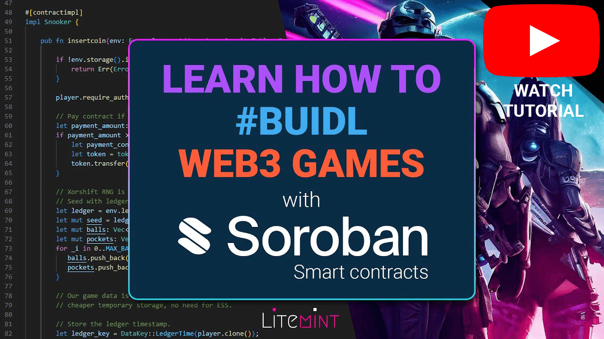

[![MIT License][license-shield]][license-url]
[![Twitter][twitter-shield]][twitter-url]


[](https://crates.io/crates/soroban-snooker)

<!-- PROJECT LOGO -->
<br />
<div align="center">
  <a href="https://snooker.litemint.com">
    
  </a>

<h3 align="center">Soroban Snooker</h3>

  <p align="center">
    A smart contract showcasing web3 gaming with Soroban on Stellar
    <br />
    <a href="https://snooker.litemint.com">Play Game Demo</a>
    ·
    <a href="https://www.youtube.com/watch?v=hUvyr3XxHv0">Developer Video Guide</a>
  </p>
</div>


<!-- ABOUT THE PROJECT -->
## About Soroban Snooker

Soroban Snooker is a smart contract, running on the Rust-based smart contracts platform [Soroban](https://soroban.stellar.org), and deployed on the [Stellar](https://stellar.org) blockchain. This project, accompanied by a simple [game client](https://snooker.litemint.com), aims to demonstrate various use cases and functionalities of web3 gaming on Soroban, including:

- [X] How to implement In-App Purchases to receive payments from players.
- [X] How to issue rewards to players such as achievement NFTs, as part of the gameplay experience.
- [X] How to implement decentralized gameplay validation, including pool physics and time-based checks.
- [X] How to utilize auth and set up admin functions for management of game assets and withdrawals.
- [X] How to employ different Soroban storage types to manage game data efficiently, including temporary, persistent, and instance storage.
- [X] How to leverage custom types for client-contract communication.
- [X] How to integrate the Freighter Stellar wallet to the game client.
- [X] How to implement a local/guest mode for players without a wallet.

### Built With

[Soroban smart contracts](https://soroban.stellar.org)

[![Rust][rust-shield]][rust-url]
[![Javascript][javascript-shield]][javascript-url]

The Soroban smart contract is written in Rust, setup instructions are provided below.

The game client, on the other hand, is written in plain Javascript and does not require any external framework. To get started, simply open the `client/game.js` file and get hacking. Please be aware that the game loop operates with a fixed frame rate, enhancing interoperability with pool physics validation in the smart contract. However, it is feasible to decouple the frame rate for smoother rendering, but implementing this is left as an exercise for the reader.

<!-- GETTING STARTED -->
## Getting Started

To begin with the project, follow these steps to set up your environment:

### Prerequisites

Ensure you have the following installed:

* Rust and Soroban

  Set up your environment for smart contract development with Soroban on Rust by following the instructions provided in the link below:
  [https://soroban.stellar.org/docs/getting-started/setup](https://soroban.stellar.org/docs/getting-started/setup)

* Stellar

  Create and fund your Stellar accounts for testing on Testnet. You will need at least 2 accounts: an admin account and a player account. Use the link below to create and fund your accounts:
  [https://laboratory.stellar.org/#account-creator?network=test](https://laboratory.stellar.org/#account-creator?network=test)

By following the above steps and setting up the required prerequisites, you will have your environment ready for working with the project.

### Install, Build, Deploy and Run

1. Cloning the Repository:
   ```sh
   git clone https://github.com/FredericRezeau/soroban-snooker.git
   ```
2. Running Tests:
   ```sh
   cargo test -- --nocapture
   ```
3. Building the Contract:
   ```sh
   cargo build --target wasm32-unknown-unknown --release
   ```
4. Deploying to Testnet:
   
   Configure the Testnet network:
   ```sh
   soroban config network add --rpc-url https://soroban-testnet.stellar.org:443 --network-passphrase 'Test SDF Network ; September 2015' TESTNET
   ```
   Configure an identity for the admin:
   ```sh
   soroban config identity add --secret-key ADMIN
   ```
   Deploy the contract and save the output value (your contract ID) using:
   ```sh
   soroban contract deploy --wasm target/wasm32-unknown-unknown/release/soroban_snooker.wasm --source ADMIN --network TESTNET
   ```
5. Initializing the contract:
   
   Follow the guide at the URL below for detailed instructions on how to wrap Stellar tokens for payments and reward assets issued on Stellar:
   [https://soroban.stellar.org/docs/advanced-tutorials/tokens#compatibility-with-stellar-assets](https://soroban.stellar.org/docs/advanced-tutorials/tokens#compatibility-with-stellar-assets)
   
   If you wish to initialize the contract using the native token, execute the following command:
   ```sh
    soroban contract invoke --network TESTNET --source ADMIN --id YOUR_CONTRACT_ID -- initialize --payment_token CDLZFC3SYJYDZT7K67VZ75HPJVIEUVNIXF47ZG2FB2RMQQVU2HHGCYSC --admin ADMIN --payment_amount 10 --reward_token CDLZFC3SYJYDZT7K67VZ75HPJVIEUVNIXF47ZG2FB2RMQQVU2HHGCYSC --reward_amount 10
   ```
6. Editing the contract ID:
   
   Open `client/game.js` and edit the following line with your contract id.
   ```js
   const contractId = "CA7VJIGYO6OU5U5BQ77B6YAQDEQQ6E5U5OMVIG5XLHZKCHZLQA3N4Q7N";
   ```
7. Optional, for Non-Freighter Users:
   
   If you are not using Freighter, open `client/game.js` and edit the following line with your test account secret seed.
   ```js
   // Enter a valid secret seed if you need testing without Freighter.
   const testSecret = "S---ECRET";
   ```

<!-- USAGE EXAMPLES -->
## Using the Smart Contract

To interact with the smart contract for testing _or just playing_, you have two main options:

1. Using the Game Client:

    * Launch the `client/index.html` file. To bypass browser limitations, consider serving the `client/index.html` file through HTTP/S.
    * If you're using Freighter, ensure that you are on testnet.

2. Using the Soroban CLI:

    * To open a game session and get a pool table, execute the following command:
     ```sh
      soroban contract invoke --network TESTNET --source PLAYER --id YOUR_CONTRACT_ID -- insertcoin --player PLAYER
     ```      
    
    * To withdraw payments, use the following command:
     ```sh
      soroban contract invoke --network TESTNET --source ADMIN --id YOUR_CONTRACT_ID -- withdraw --account YOUR_STELLAR_ADDRESS --amount 10
     ```


<!-- CONTRIBUTING -->
## Contributing

Contributions are what make the open source community such an amazing place to learn, inspire, and create. Any contributions you make are **greatly appreciated**.

If you have a suggestion that would make this better, please fork the repo and create a pull request. You can also simply open an issue with the tag "enhancement".
Don't forget to give the project a star! Thanks again!

1. Fork the Project
2. Create your Feature Branch (`git checkout -b feature/AmazingFeature`)
3. Commit your Changes (`git commit -m 'Add some AmazingFeature'`)
4. Push to the Branch (`git push origin feature/AmazingFeature`)
5. Open a Pull Request


<!-- LICENSE -->
## License

Distributed under the MIT License. See `LICENSE` for more information.


<!-- CONTACT -->
## Contact

Fred Kyung-jin Rezeau - [@FredericRezeau](https://twitter.com/fredericrezeau)

Litemint Marketplace: [https://litemint.com](https://litemint.com)

Check out our tradable card game on Stellar: [https://litemint.io](https://litemint.io)

Join our discord server: [https://litemint.gg](https://litemint.gg)


<!-- MARKDOWN LINKS & IMAGES -->
[license-shield]: https://img.shields.io/github/license/FredericRezeau/soroban-snooker.svg?style=for-the-badge
[license-url]: https://github.com/FredericRezeau/soroban-snooker/blob/master/LICENSE
[twitter-shield]: https://img.shields.io/badge/-Twitter-black.svg?style=for-the-badge&logo=twitter&colorB=555
[twitter-url]: https://twitter.com/fredericrezeau

[rust-shield]: https://img.shields.io/badge/Rust-000000?style=flat-square&logo=Rust&logoColor=white
[rust-url]: https://www.rust-lang.org
[javascript-shield]: https://img.shields.io/badge/JavaScript-F7DF1E?style=flat-square&logo=javascript&logoColor=black
[javascript-url]: https://vanilla-js.com
